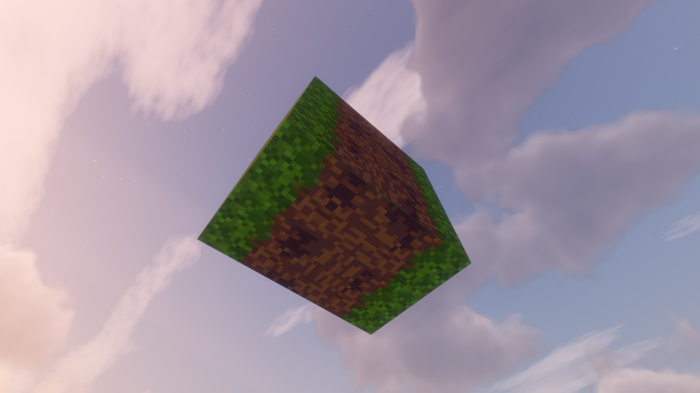
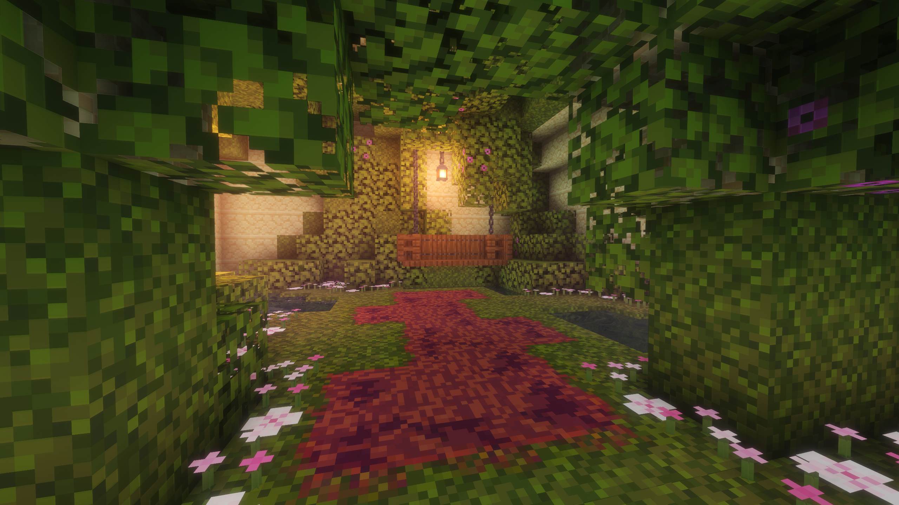

# Camerapture Plus

> Personal fork of [Camerapture](https://github.com/chrrs/camerapture) mod, extended and improved for personal use.

---

This version was created for me and my brother, as the original mod was missing a few features we wanted (such as placing images on floors and ceilings).  
I'm more of a designer than a programmer and still learning so expect very bad code :P.

---

## 🚀 Feature Progress

|Feature| Status|
|-|-|
|Place images on floor (facing upward)| ✅ Done|
|Place images on ceiling (facing downward)| ✅ Done|
|Image crop methods (fit, contain, etc.)| ⬜️ Planned|
|Support for different camera aspect ratios| ⬜️ Planned|
|Image storage & retrieval in-game| ⬜️ Planned|
|Easy image export to file| ⬜️ Planned|
|Additional features / improvements| ⬜️ Planned|

---

## 📸 Feature Previews

### ✅ Place images on floor (facing upward)

### ✅ Place images on ceiling (facing downward)

---

## ⚠️ Notes

- This mod may still contain bugs.
- Full credit goes to the original [Camerapture](https://github.com/chrrs/camerapture) repository ofc!

---

_This fork is built on top of the [original Camerapture mod](https://github.com/chrrs/camerapture)._
